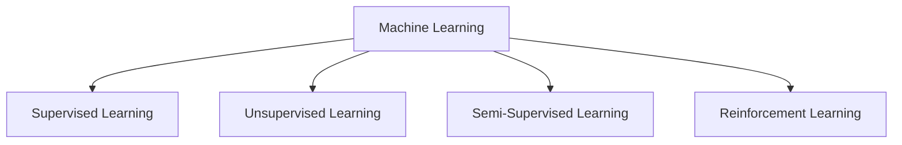
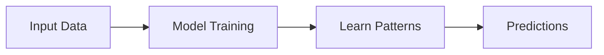
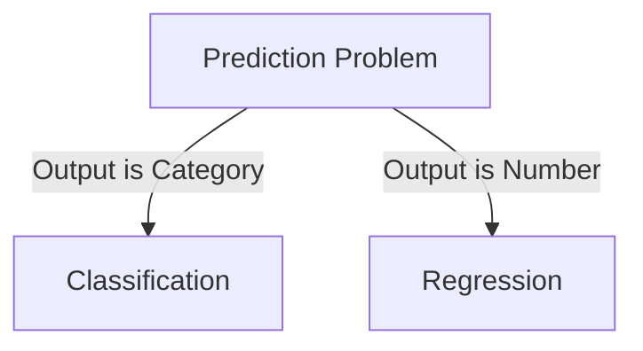
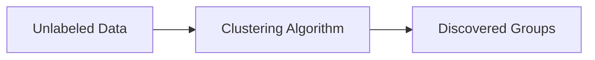
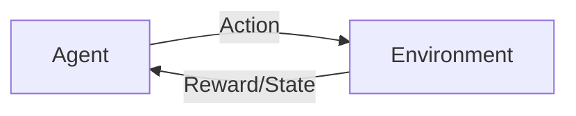

# Basics of Machine Learning

## 1. What is Machine Learning?

Machine Learning (ML) is a way to teach computers to learn patterns from
data and make decisions without being explicitly programmed for every
rule.

Instead of writing:

``` python
if marks > 40:
    print("Pass")
```

We provide data to the computer, and it learns the pattern on its own.

------------------------------------------------------------------------

## 2. Why Do We Need Machine Learning?

-   Email spam detection\
-   Netflix recommendations\
-   Face recognition\
-   Self-driving cars\
-   Predicting prices (houses, dresses, cars)

------------------------------------------------------------------------

# 3. Types of Machine Learning

-   Supervised Learning\
-   Unsupervised Learning\
-   Semi-Supervised Learning\
-   Reinforcement Learning

------------------------------------------------------------------------

# 1. Supervised Learning

## What is Supervised Learning?

In supervised learning, the model learns from labeled data.

That means: - We give the computer input data\
- We also provide the correct output\
- It learns the relationship between them

### Example

  Hours Studied   Result
  --------------- --------
  2               Fail
  5               Pass
  8               Pass

Instead of writing:

``` python
if marks > 40:
    print("Pass")
```

The model learns the rule from data.

------------------------------------------------------------------------

## Types of Supervised Learning

### 1. Classification

Used when the output is a category.

**Examples:** - Yes / No\
- Spam / Not Spam\
- Cat / Dog\
- Pass / Fail

Classification deals with grouping into categories.

#### Algorithms for Classification

-   Logistic Regression\
-   Decision Tree\
-   K-Nearest Neighbors (KNN)\
-   Support Vector Machine (SVM)\
-   Kernel SVM\
-   Naive Bayes\
-   Random Forest

------------------------------------------------------------------------

### 2. Regression

Used when the output is a number.

**Examples:** - House price prediction\
- Temperature prediction\
- Predicting exam score

Regression deals only with numerical outputs.

#### Algorithms for Regression

-   Linear Regression\
-   Multiple Linear Regression\
-   Polynomial Regression\
-   Support Vector Regression (SVR)\
-   Gaussian Process Regression\
-   Ridge Regression\
-   Lasso Regression\
-   Random Forest

------------------------------------------------------------------------

## Example Question

**How will the price of a dress be decided?**

Possible features: - Brand\
- Fabric\
- Size\
- Season\
- Demand\
- Online reviews

If price is a number → Regression problem\
If price category (Cheap / Medium / Expensive) → Classification problem

------------------------------------------------------------------------

# 2. Unsupervised Learning

## 2.1 What is Unsupervised Learning?

In unsupervised learning, we provide only input data, but no correct
answers.

The model finds patterns by itself.

### Example

Suppose we give data about customers:

-   Age\
-   Shopping amount\
-   Frequency of purchase

The algorithm groups similar customers together.\
We did not tell it the groups. It discovered them.

------------------------------------------------------------------------

## 2.2 Unsupervised Algorithms

-   K-Means Clustering\
-   Hierarchical Clustering\
-   DBSCAN (Density-Based Spatial Clustering of Applications with
    Noise)\
-   Principal Component Analysis (PCA)\
-   Probabilistic clustering (distribution-based clustering)

------------------------------------------------------------------------

# 3. Semi-Supervised Learning

## What is Semi-Supervised Learning?

It is a mix of: - A small amount of labeled data\
- A large amount of unlabeled data

Used when labeling data is expensive or difficult.

### Example

Imagine you have: - 1000 medical images\
- Only 50 are labeled

The model learns from the 50 labeled images and improves using the
remaining unlabeled images.

------------------------------------------------------------------------

## Algorithms for Semi-Supervised Learning

### Inductive Methods

-   Self-training\
-   Co-training

### Transductive and Graph-Based Methods

-   Label Propagation\
-   Label Spreading

### Deep Learning Approaches

-   Generative Adversarial Networks (GANs)\
-   Consistency Regularization\
-   Generative Models\
-   Semi-Supervised Support Vector Machines (S3VMs)

------------------------------------------------------------------------

# 4. Reinforcement Learning

## What is Reinforcement Learning?

In Reinforcement Learning (RL), an agent learns by:

-   Taking actions\
-   Receiving rewards or penalties\
-   Improving over time

It learns through trial and error.

### Example

Think of training a game-playing AI.

-   If it wins → reward\
-   If it loses → penalty

Over time, it learns the best strategy.

------------------------------------------------------------------------

## Key Terms in Reinforcement Learning

-   **Agent** → The learner\
-   **Environment** → Where the agent acts\
-   **Action** → What the agent does\
-   **Reward** → Feedback received

------------------------------------------------------------------------

## Algorithms in Reinforcement Learning

### Value-Based

-   Q-Learning\
-   Deep Q Networks (DQN)\
-   Value Iteration

### Policy-Based

-   Policy Gradient Methods\
-   REINFORCE (Monte Carlo)\
-   Trust Region Policy Optimization (TRPO)

### Actor-Critic

-   Advantage Actor-Critic (A2C)\
-   Asynchronous Advantage Actor-Critic (A3C)\
-   Proximal Policy Optimization (PPO)\
-   Deep Deterministic Policy Gradient (DDPG)\
-   Soft Actor-Critic (SAC)

### Other Methods

-   Monte Carlo Tree Search (MCTS)\
-   State-Action-Reward-State-Action (SARSA)\
-   Dynamic Programming

------------------------------------------------------------------------

# scikit-learn Library Setup

``` bash
conda create -n python_ml python=3.10
conda activate python_ml
pip install scikit-learn
```

------------------------------------------------------------------------

# Final Example Workflow

1.  Collect features (brand, fabric, demand, etc.)\
2.  Choose regression or classification\
3.  Train model\
4.  Evaluate performance


---

# Visual Diagrams

## 1. Types of Machine Learning



---

## 2. Supervised Learning Workflow



---

## 3. Classification vs Regression



---

## 4. Unsupervised Learning Clustering



---

## 5. Reinforcement Learning Cycle



---
